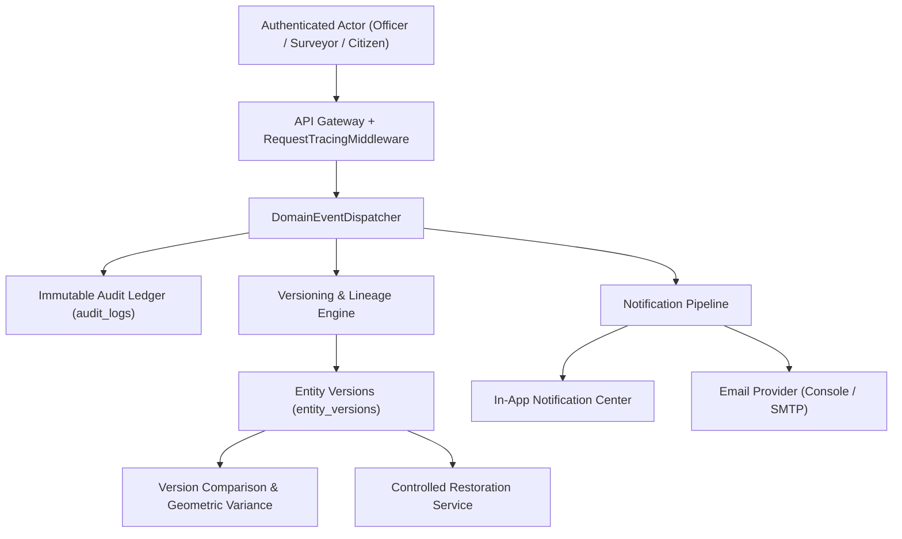
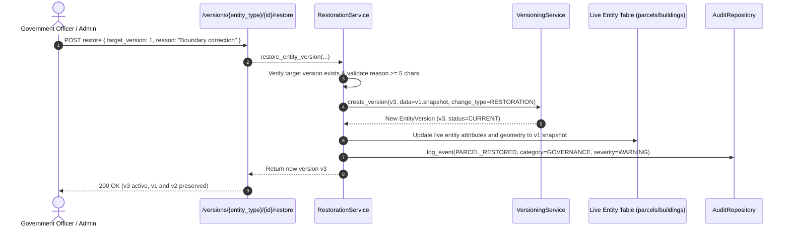

# GeoVertex Audit, Versioning, Notifications & System Governance

**Phase 13 — Technical Documentation & Architecture Specification**

---

> [!IMPORTANT]
> **LEGAL & CADASTRAL DISCLAIMER**: 
> 1. Audit trail records, version comparisons, and restoration histories are **immutable technical system records** maintained for data integrity and operational governance.
> 2. Geometric variance calculations (area deltas, perimeter variations, centroid offsets, and intersection-over-union overlaps) are **deterministic mathematical metrics** and do NOT represent legal ownership boundaries or official cadastral title decisions.
> 3. Notification dispatches adhere to a strict **No-Fake-Delivery** guarantee: Delivery statuses truthfully reflect delivery state and never simulate successful external transmission if SMTP or mail gateways are unconfigured.

---

## Table of Contents

1. [Overview & Core Principles](#overview--core-principles)
2. [Immutable Audit Trail](#immutable-audit-trail)
3. [Deterministic Entity Versioning Engine](#deterministic-entity-versioning-engine)
4. [Version Comparison & Spatial Variance](#version-comparison--spatial-variance)
5. [Controlled Restoration & History Preservation](#controlled-restoration--history-preservation)
6. [Cross-Entity Lineage & Provenance](#cross-entity-lineage--provenance)
7. [Multi-Channel Notification Infrastructure](#multi-channel-notification-infrastructure)
8. [Notification Preferences & Compliance Guarantees](#notification-preferences--compliance-guarantees)
9. [Background Processing & Worker Architecture](#background-processing--worker-architecture)
10. [System Governance & Integrity Verification](#system-governance--integrity-verification)
11. [REST API Reference](#rest-api-reference)
12. [Database Schema & Migrations](#database-schema--migrations)
13. [RBAC & Authorization Matrix](#rbac--authorization-matrix)

---

## 1. Overview & Core Principles

Phase 13 establishes the enterprise governance, provenance, and notification spine of GeoVertex. It provides four interlocking pillars:

1. **Immutable Audit Trail**: Append-only operational logging capturing all actions, security events, cadastral mutations, and administrative overrides with structured before/after snapshots and distributed correlation IDs (`X-Correlation-ID`).
2. **Deterministic Entity Versioning**: Reconstructable historical snapshots for all cadastral entities (Parcels, Properties, Buildings, Floors, Units, Surveys, Documents, Identifiers). Previous active records transition to `SUPERSEDED`, while new versions atomically acquire `v(N+1)` with canonical SHA-256 geometry and content hashes.
3. **Controlled Rollback (Restoration)**: Rollback to a historical state creates a **NEW** version (`change_type="RESTORATION"`), strictly preserving every historical record without mutation or physical overwrites.
4. **Reliable Multi-Channel Notifications**: Real-time in-app alerts and email dispatches with user channel preferences, protected mandatory compliance alerts, and zero fabricated deliveries.

---

## 2. Immutable Audit Trail

### Immutability Guarantees
- **Append-Only Ledger**: No `UPDATE` or `DELETE` endpoints exist for audit records. Records are written directly to `audit_logs` and cannot be mutated by any user or administrator.
- **Correlation & Request Tracing**: Every inbound HTTP request receives an `X-Request-ID` and `X-Correlation-ID` via `RequestTracingMiddleware`, propagating across async database transactions and external service calls.
- **Multi-Dimensional Querying**: Full support for filtering across entity type, entity ID, actor ID, action name, audit category, severity, result status, date ranges, and workflow/case IDs.
- **Compliance Export**: High-performance streaming export to structured CSV and formatted JSON with automatic export-event auditing.

### Audit Categories
- `AUTHENTICATION`: Login, token refresh, logout, session expiration
- `AUTHORIZATION`: RBAC checks, access denials, privilege escalations
- `PROPERTY`: Parcel, property, unit attribute adjustments
- `GIS`: Spatial boundary realignments, CRS projections, coordinate updates
- `SURVEY`: Project assignments, total station uploads, evidence attachments
- `AI`: Building footprint extraction, floorplan vectorization, confidence reviews
- `VALIDATION`: Topology rule execution, overlap detection, sliver identification
- `DOCUMENT`: OCR extraction, deed parsing, ownership linkage
- `CHANGE_DETECTION`: Temporal comparisons, raster subtraction, boundary shifts
- `UTILITY`: Subsurface network traces, 3D pipe clearances, clash detection
- `IDENTIFIER`: Technical 3D identifier generation, supersession, retirement
- `WORKFLOW`: Citizen service requests, SLA timers, case assignments
- `NOTIFICATION`: Alert generation, preference updates, batch reads
- `GOVERNANCE`: Entity restorations, integrity audits, compliance exports
- `SYSTEM`: Background jobs, database migrations, configuration adjustments

---

## 3. Deterministic Entity Versioning Engine

### Snapshot Structure
Every `EntityVersion` contains:
1. `version_number`: Monotonically increasing integer (1, 2, 3...) per entity.
2. `version_uuid`: Cryptographically secure UUID string reference.
3. `version_status`: `CURRENT`, `SUPERSEDED`, `RETIRED`, `REVOKED`, `ARCHIVED`, `DRAFT`.
4. `snapshot_data`: Full dictionary of scalar and relational attributes.
5. `geometry_wkt`: Canonical Well-Known Text (WKT) representation of geometry.
6. `geometry_hash`: SHA-256 hash of the canonical WKT.
7. `content_hash`: SHA-256 hash of the sorted canonical JSON snapshot payload.
8. `geometry_metrics`: Pre-calculated spatial metrics (area, perimeter/length, centroid coordinates, bounding box).
9. Provenance: `change_type`, `change_reason`, `source_type` (`MANUAL`, `SURVEY`, `AI`, `DOCUMENT`, `WORKFLOW`, `ADMIN`), and originating `source_id`.

---

## 4. Version Comparison & Spatial Variance

The `VersionComparisonService` computes deterministic variances between any two versions:
- **Attribute Diff**: Identifies `modified_fields` with before/after values, `added_fields`, and `removed_fields`.
- **Spatial Metrics Diff**:
  - Area Delta ($\Delta Area = Area_B - Area_A$) and percentage variance
  - Perimeter / Length Delta
  - Centroid Offset: Euclidean distance between centroids:
    $$d = \sqrt{(x_B - x_A)^2 + (y_B - y_A)^2}$$
  - Intersection-over-Union (IoU) overlap metric
  - Bounding box expansions or contractions
  - Geometry Hash Match indicator (`geometry_changed`)

---

## 5. Controlled Restoration & History Preservation

**Key Invariant**: History is **immutable**. Restoring version 1 when currently at version 2 creates version 3 (`change_type="RESTORATION"`). Historical rows `v1` and `v2` remain completely intact in the database.

---

## 6. Multi-Channel Notification Infrastructure

- **Supported Channels**: `IN_APP` and `EMAIL`.
- **No-Fake-Delivery Policy**:
  - When SMTP is not configured in production settings, email notifications fail explicitly with status `EMAIL_NOT_CONFIGURED` or `FAILED`. The platform never marks an unconfigured email as delivered.
  - In development environments, `ConsoleEmailProvider` logs cleanly formatted email previews to application logs without making false external network assertions.
- **Status Lifecycle**: `QUEUED` $\rightarrow$ `PROCESSING` $\rightarrow$ `SENT` / `DELIVERED` $\rightarrow$ `READ` (or `FAILED` / `CANCELLED`).
- **Batch Operations**: Atomic `read-all` transitions and fast unread counters.

---

## 7. Notification Preferences & Compliance Guarantees

Users configure delivery channel preferences per notification type. However, to guarantee statutory compliance and security responsiveness, **mandatory notification types cannot be disabled**:
- `SYSTEM_ALERT`: Critical platform outages and operational notices
- `SECURITY_INCIDENT`: Unauthorized access attempts and credential warnings
- `ACCOUNT_SUSPENDED`: Administrative enforcement actions
- `ENTITY_RESTORED`: Cadastral rollbacks affecting verified property rights

Any client attempt to disable these mandatory alerts returns HTTP 400 Bad Request with an explicit compliance policy explanation.

---

## 8. Background Processing & Worker Architecture

The `NotificationWorker` handles queued messages with:
- Configurable batch size processing.
- Idempotent delivery checks.
- Expiration validation (`expires_at < now` transitions to `CANCELLED`).
- Exponential retry tracking with failure reason recording up to `MAX_RETRIES = 3`.

---

## 9. System Governance & Integrity Verification

The `GovernanceService` exposes:
- **Governance Dashboard**: Aggregated operational counts, audit category distributions, active vs superseded version counts, and notification delivery health.
- **Automated Integrity Verifications**:
  - Verification that no entity possesses more than one `CURRENT` version.
  - Verification that all audit records have valid timestamps and event UUIDs.
  - Detection of broken version chains or missing parent snapshot references.

---

## 10. REST API Reference

### Audit Endpoints
| Method | Endpoint | Description | Auth Roles |
|---|---|---|---|
| `GET` | `/api/v1/audit` | Query audit trail with multi-criteria filters | `GOVERNMENT_OFFICER`, `ADMIN` |
| `GET` | `/api/v1/audit/{id}` | Get single audit event details and diffs | `GOVERNMENT_OFFICER`, `ADMIN` |
| `GET` | `/api/v1/audit/statistics` | Aggregated audit statistics by category & severity | `GOVERNMENT_OFFICER`, `ADMIN` |
| `GET` | `/api/v1/audit/export` | Stream filtered audit records to CSV or JSON | `GOVERNMENT_OFFICER`, `ADMIN` |

### Versioning & Restoration Endpoints
| Method | Endpoint | Description | Auth Roles |
|---|---|---|---|
| `GET` | `/api/v1/versions/{type}/{id}` | List version history timeline for an entity | All Authenticated |
| `GET` | `/api/v1/versions/{type}/{id}/{version_number}` | Get specific historical snapshot | All Authenticated |
| `GET` | `/api/v1/versions/compare/{version_a_id}/{version_b_id}` | Compare two versions (scalar + geometric variance) | All Authenticated |
| `POST` | `/api/v1/versions/{type}/{id}/restore` | Controlled rollback creating version $N+1$ | `GOVERNMENT_OFFICER`, `ADMIN` |
| `GET` | `/api/v1/versions/{type}/{id}/lineage` | Query cross-entity split/merge lineage | All Authenticated |

### Notification Endpoints
| Method | Endpoint | Description | Auth Roles |
|---|---|---|---|
| `GET` | `/api/v1/notifications` | List user notifications (unread / severity filter) | All Authenticated |
| `GET` | `/api/v1/notifications/unread-count` | Quick unread notification count badge | All Authenticated |
| `POST` | `/api/v1/notifications/{id}/read` | Mark specific notification as read | All Authenticated |
| `POST` | `/api/v1/notifications/read-all` | Mark all unread notifications as read | All Authenticated |
| `GET` | `/api/v1/notifications/preferences` | Get user notification channel preferences | All Authenticated |
| `PUT` | `/api/v1/notifications/preferences` | Update preference for type/channel | All Authenticated |
| `POST` | `/api/v1/notifications/test` | Trigger test notification dispatch | `ADMIN` only |

### Governance Dashboard Endpoints
| Method | Endpoint | Description | Auth Roles |
|---|---|---|---|
| `GET` | `/api/v1/governance/dashboard` | Aggregated platform governance health metrics | `GOVERNMENT_OFFICER`, `ADMIN` |
| `GET` | `/api/v1/governance/integrity` | Run automated data integrity consistency checks | `GOVERNMENT_OFFICER`, `ADMIN` |

---

## 11. RBAC & Authorization Matrix

| Role | View Audit Logs | Export Audit Logs | View Version History | Compare Versions | Restore Version | View Own Notifications | Manage Preferences | Governance Dashboard |
|---|:---:|:---:|:---:|:---:|:---:|:---:|:---:|:---:|
| **ADMIN** | ✅ | ✅ | ✅ | ✅ | ✅ | ✅ | ✅ | ✅ |
| **GOVERNMENT_OFFICER** | ✅ | ✅ | ✅ | ✅ | ✅ | ✅ | ✅ | ✅ |
| **URBAN_PLANNER** | ❌ (403) | ❌ (403) | ✅ | ✅ | ❌ (403) | ✅ | ✅ | ❌ (403) |
| **SURVEYOR** | ❌ (403) | ❌ (403) | ✅ | ✅ | ❌ (403) | ✅ | ✅ | ❌ (403) |
| **CITIZEN** | ❌ (403) | ❌ (403) | ✅ (Linked) | ✅ | ❌ (403) | ✅ | ✅ | ❌ (403) |
| **Public / Anonymous** | ❌ (401) | ❌ (401) | ❌ (401) | ❌ (401) | ❌ (401) | ❌ (401) | ❌ (401) | ❌ (401) |
