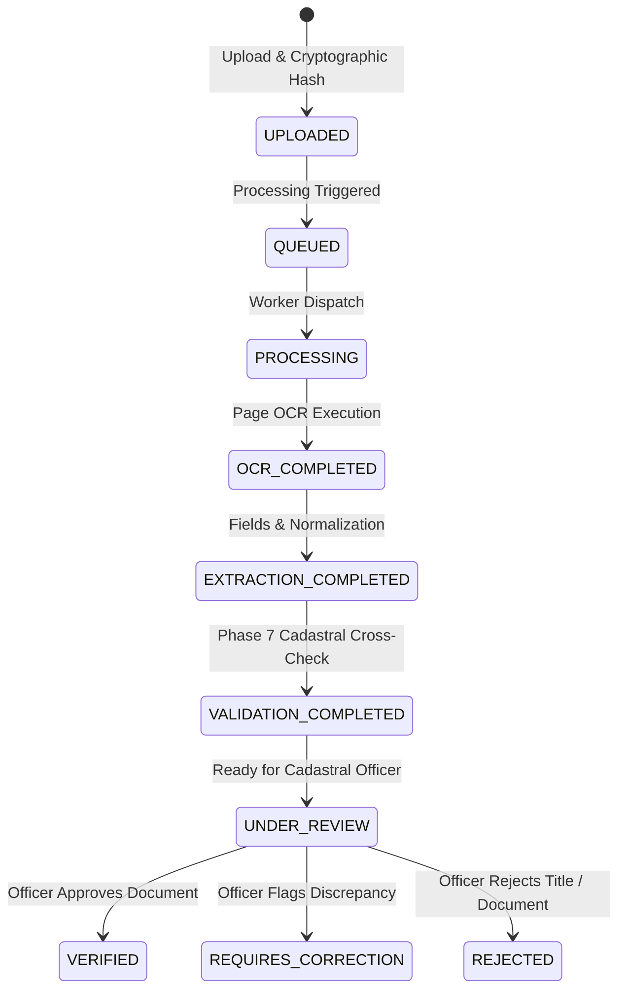

# GeoVertex: Phase 8 AI Document Intelligence & Property Document Verification

## 1. Overview & System Purpose

Phase 8 establishes the **AI Document Intelligence Subsystem** for GeoVertex. It provides end-to-end ingestion, deterministic OCR extraction, document classification, structured field extraction with bounding box provenance, deterministic normalization, cadastral entity linking (against parcels, properties, 3D buildings, and units), integration with Phase 7 spatial topology validation, and a human-in-the-loop review and verification workflow.

### Fundamental System Invariant & Governance Guarantee
> **AI Assists Document Processing; AI Must NOT Determine Legal Ownership.**
> Automated document analysis produces candidate data, OCR text, extracted fields, and match confidences. It does NOT independently adjudicate land ownership, modify titles, or alter cadastral rights. All property verifications and title determinations strictly require review and sign-off by authorized cadastral officers.

---

## 2. Processing Pipeline Architecture

```
┌─────────────────────────────────────────────────────────────────────────────┐
│ 1. Document Upload & Ingestion                                              │
│    - File validation (PDF, TIFF, PNG, JPEG; max 50 MB)                      │
│    - SHA-256 cryptographic hash computation & immutability versioning        │
│    - Status: UPLOADED                                                       │
└──────────────────────────────────────┬──────────────────────────────────────┘
                                       │
┌──────────────────────────────────────▼──────────────────────────────────────┐
│ 2. Document Processing Pipeline (DocumentProcessingWorker)                  │
│    Stage 1: Job Queued & Initialized (status: QUEUED -> PROCESSING)         │
│    Stage 2: Page Extraction & Rendering (DocumentPage records)               │
│    Stage 3: OCR Processing (PyPDFTextExtractor / Tesseract fallback)       │
│    Stage 4: Document Classification (Sale Deed, Survey Plan, Patta, etc.)    │
│    Stage 5: Structured Field Extraction (parcel_number, survey_number, etc.) │
│    Stage 6: Deterministic Normalization (ISO dates, metric sq.m extents)    │
│    Stage 7: Cadastral Entity Matching (Parcel, Property, Building, Unit)    │
│    Stage 8: Phase 7 Topology Validation Integration (Discrepancy Checks)     │
│    Stage 9: Governance Review Flagging (manual_review_required = True)      │
│    Stage 10: Complete (status: UNDER_REVIEW)                                │
└──────────────────────────────────────┬──────────────────────────────────────┘
                                       │
┌──────────────────────────────────────▼──────────────────────────────────────┐
│ 3. Cadastral Officer Human-in-the-Loop Review & Verification Workspace      │
│    - Visual Document Viewer with bounding-box highlighting & OCR text       │
│    - Field-by-field review: Accept, Correct, or Reject with comment audit    │
│    - Entity Link Management: Confirm or Reject candidate associations       │
│    - Discrepancy Reconciliation: View Phase 7 discrepancies (area diffs)    │
│    - Verification Decision: VERIFIED | REQUIRES_CORRECTION | REJECTED       │
└─────────────────────────────────────────────────────────────────────────────┘
```

---

## 3. Supported Document Types

| Document Type | Code | Typical Extracted Fields |
|---|---|---|
| **Sale Deed / Conveyance** | `DEED` | `document_number`, `document_date`, `parcel_number`, `survey_number`, `land_area`, `boundaries` |
| **Title Certificate / Patta** | `TITLE_CERTIFICATE` | `parcel_number`, `survey_number`, `owner_name`, `land_area`, `issuing_authority` |
| **Survey Plan / Cadastral Map** | `SURVEY_PLAN` | `survey_number`, `parcel_number`, `scale`, `boundary_coordinates`, `land_area` |
| **Encumbrance Certificate** | `ENCUMBRANCE_CERTIFICATE` | `survey_number`, `document_number`, `period_start`, `period_end`, `liens` |
| **Tax Receipt / Assessment** | `TAX_RECEIPT` | `assessment_number`, `property_reference`, `tax_period`, `receipt_date` |
| **Building Permit** | `BUILDING_PERMIT` | `building_number`, `floor_count`, `built_up_area`, `approval_date` |
| **Completion Certificate** | `COMPLETION_CERTIFICATE` | `building_number`, `occupancy_type`, `height_meters`, `issue_date` |
| **Court Order / Decree** | `COURT_ORDER` | `case_number`, `court_name`, `dispute_summary`, `order_date` |
| **Partition Deed** | `PARTITION_DEED` | `share_percentage`, `parcel_number`, `allotment_details` |
| **Gift Deed** | `GIFT_DEED` | `donor_name`, `donee_name`, `parcel_number`, `execution_date` |
| **Lease Agreement** | `LEASE_AGREEMENT` | `lease_term`, `property_reference`, `start_date`, `expiry_date` |
| **Other Legal Record** | `OTHER` | `document_number`, `document_date`, `reference_notes` |

---

## 4. Deterministic Normalization Rules

1. **Dates**:
   - Accepts diverse formats: `DD/MM/YYYY`, `YYYY-MM-DD`, `DD-MM-YYYY`, `DD Month YYYY`, `Month DD, YYYY`.
   - Produces strict ISO 8601: `YYYY-MM-DD`.
2. **Land & Built-up Areas**:
   - Converts imperial and regional units to canonical square meters (`sq.m`):
     - `sq ft` / `sq feet` -> $\times 0.092903$
     - `sq yards` -> $\times 0.836127$
     - `acres` -> $\times 4046.86$
     - `hectares` -> $\times 10000.0$
     - `guntas` -> $\times 101.17$
3. **Survey Numbers**:
   - Canonical alphanumeric uppercase with cleaned whitespace and uniform slashes (`45/1A`).
4. **Addresses & Boundaries**:
   - Trims and normalizes whitespace and punctuation.

---

## 5. Phase 7 Validation Integration (Discrepancy Rules)

When an uploaded document is linked to a cadastral entity (parcel, property, building, unit), the Phase 7 validation engine automatically checks consistency between the extracted legal document attributes and the PostGIS cadastral registry:

| Rule Code | Issue Code | Severity | Description |
|---|---|---|---|
| `DOC_001` | `DOCUMENT_PARCEL_REFERENCE_MISMATCH` | `CRITICAL` | Document cites a parcel number that does not match the linked parcel's official identifier. |
| `DOC_002` | `DOCUMENT_BUILDING_REFERENCE_MISMATCH` | `ERROR` | Document cites a building number that does not match the linked 3D building. |
| `DOC_003` | `DOCUMENT_UNIT_REFERENCE_MISMATCH` | `ERROR` | Document cites a unit number that does not match the linked vertical unit. |
| `DOC_004` | `DOCUMENT_AREA_MISMATCH` | `WARNING` | Stated document land area differs from GIS geodesic polygon area by more than configured tolerance (default 5%). |
| `DOC_005` | `DOCUMENT_DATE_INCONSISTENCY` | `WARNING` | Document date is recorded in the future or precedes parcel creation baseline. |
| `DOC_006` | `DOCUMENT_DUPLICATE_CANDIDATE` | `WARNING` | Another active document in the same jurisdiction shares the same document number. |
| `DOC_007` | `DOCUMENT_NUMBER_MISSING` | `INFO` | Official deed or certificate record is missing an extracted registration number. |
| `DOC_008` | `PARCEL_REFERENCE_MISSING` | `WARNING` | Document is linked to a parcel, but contains no extracted parcel or survey reference. |

---

## 6. Document Status Lifecycle



---

## 7. Role-Based Access Control (RBAC)

| User Role | View Documents | Upload Document | Trigger AI Processing | Review / Correct Fields | Confirm Entity Links | Verify Document |
|---|:---:|:---:|:---:|:---:|:---:|:---:|
| `ADMIN` | Yes | Yes | Yes | Yes | Yes | Yes |
| `GOVERNMENT_OFFICER` | Yes | Yes | Yes | Yes | Yes | Yes |
| `SURVEYOR` | Yes | Yes | Yes | Yes | Yes | No |
| `URBAN_PLANNER` | Yes | Yes | Yes | No | No | No |
| `CITIZEN` | Restricted (Own) | No | No | No | No | No |
