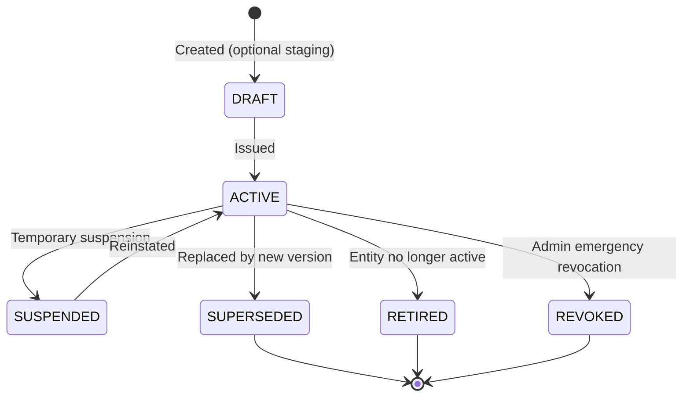

# GeoVertex Technical 3D Property Identifier Engine

**Phase 12 — Technical Documentation**

---

> [!IMPORTANT]
> **DISCLAIMER**: GeoVertex Technical 3D Identifiers (`PROPERTY_3D_ID` and related types) are **deterministic technical system identifiers** generated by GeoVertex for internal spatial entity tracking. They are **NOT**:
> - Official ULPINs (Unique Land Parcel Identification Numbers)
> - Legal ownership identifiers
> - Government-recognized cadastral registration numbers
> - Title deed identifiers
>
> They **MAY** be: technical system references, machine-readable spatial entity codes, QR-linked verification identifiers for internal and inter-agency use.

---

## Table of Contents

1. [Overview](#overview)
2. [Identifier Format & Structure](#identifier-format--structure)
3. [Identifier Types](#identifier-types)
4. [Identifier Lifecycle](#identifier-lifecycle)
5. [Scheme System](#scheme-system)
6. [Generation Algorithm](#generation-algorithm)
7. [QR Code & Token Verification](#qr-code--token-verification)
8. [API Reference](#api-reference)
9. [Database Schema](#database-schema)
10. [RBAC & Authorization](#rbac--authorization)
11. [Bulk Generation](#bulk-generation)
12. [Lineage Tracking](#lineage-tracking)
13. [Integration Guide](#integration-guide)
14. [Legal Disclaimer (Full)](#legal-disclaimer-full)

---

## Overview

The GeoVertex Technical 3D Property Identifier Engine generates **deterministic, stable, human-readable identifiers** for spatial entities in the cadastral hierarchy:

```
Jurisdiction → Parcel → Building → Floor → Unit
```

Each level gets its own identifier type, and the full unit-level identifier encodes the complete spatial hierarchy.

**Key properties:**
- **Deterministic**: Same spatial entity always gets the same identifier
- **Idempotent**: Generating twice returns the same identifier without creating duplicates
- **Collision-safe**: Database-enforced uniqueness constraints
- **Auditable**: Full audit trail for every lifecycle event
- **QR-enabled**: Server-generated QR codes with signed verification tokens
- **Scheme-configurable**: Format rules stored in `IdentifierScheme`, versioned and upgradeable

---

## Identifier Format & Structure

### Default Scheme: `GV3D-V1`

```
GV-{JURISDICTION}-{PARCEL}-{BUILDING}-{FLOOR}-{UNIT}
```

| Component | Example Raw Input | Normalized | Notes |
|:---|:---|:---|:---|
| Prefix | — | `GV` | Fixed per scheme |
| Jurisdiction | `JUR-W101` | `W101` | Strips `JUR-` prefix |
| Parcel | `GV-W101-P101` | `P101` | Strips platform+jurisdiction prefix |
| Building | `BLD-W101-001` | `B001` | Strips `BLD-XXXX-` prefix, pads to 3 digits |
| Floor | `floor_number=2` | `F02` | Zero-padded; basement: `FB01` for floor −1 |
| Unit | `BLD-W101-001-F1-U101` | `U101` | Strips to `U` + unit suffix |

**Full example**: `GV-W101-P101-B001-F02-U101`

### Floor encoding

| `floor_number` | Encoded | Description |
|:---|:---|:---|
| `0` | `F00` | Ground floor |
| `1` | `F01` | First upper floor |
| `2` | `F02` | Second upper floor |
| `-1` | `FB01` | First basement |
| `-2` | `FB02` | Second basement |

---

## Identifier Types

| Enum Value | Description | Example |
|:---|:---|:---|
| `JURISDICTION_ID` | Identifies a jurisdiction | `GV-W101` |
| `PARCEL_ID` | Identifies a land parcel | `GV-W101-P101` |
| `BUILDING_ID` | Identifies a building footprint | `GV-W101-P101-B001` |
| `FLOOR_ID` | Identifies a specific floor | `GV-W101-P101-B001-F02` |
| `UNIT_ID` | Identifies a property unit | `GV-W101-P101-B001-F02-U101` |
| `PROPERTY_3D_ID` | Full 3D spatial identifier (same as `UNIT_ID`) | `GV-W101-P101-B001-F02-U101` |

---

## Identifier Lifecycle



| Status | Description |
|:---|:---|
| `DRAFT` | Pre-issued, not yet active |
| `ACTIVE` | Valid and in use |
| `SUSPENDED` | Temporarily suspended |
| `SUPERSEDED` | Replaced by a newer identifier |
| `RETIRED` | Entity decommissioned; identifier archived |
| `REVOKED` | Emergency revocation by admin |

**Supersession chain**: Each identifier carries `supersedes_identifier_id` (predecessor) and `superseded_by_identifier_id` (successor), forming a linked chain.

---

## Scheme System

An `IdentifierScheme` defines:
- **Prefix**: e.g. `GV`
- **Separator**: e.g. `-`
- **Component extraction rules**: per-level normalization rule names
- **Version**: for orderly upgrades
- **Effective dates**: for time-bounded scheme activation

### Built-in extraction rules

| Rule Name | Applies To | Behavior |
|:---|:---|:---|
| `strip_prefix_code` | Jurisdiction, Parcel | Strips known system prefixes (`JUR-`, `GV-XXXX-`) |
| `strip_prefix_ref` | Building | Strips `BLD-XXXX-` pattern |
| `strip_floor_suffix` | Floor | Extracts `F<n>` or `FB<n>` from floor code |
| `strip_unit_suffix` | Unit | Extracts `U<suffix>` from unit code |

---

## Generation Algorithm

```
1. Load IdentifierScheme (active by default, or specified)
2. Validate entity UUID exists in DB
3. Traverse spatial hierarchy upward to resolve all parent entities
4. Check for existing ACTIVE identifier (idempotency — return existing if found)
5. Normalize each level's stable reference field:
   - jurisdiction.code → jurisdiction_component
   - parcel.parcel_code → parcel_component
   - building.building_reference → building_component
   - floor.floor_code + floor.floor_number → floor_component
   - unit.unit_code + unit.unit_number → unit_component
6. Assemble identifier: prefix + separator + [jc, pc, bc, fc, uc].join(separator)
7. Check collision (DB lookup on identifier_value)
   - If collision with different entity: raise IdentifierCollisionError (409)
   - If collision with same entity: idempotent, return existing
8. Generate HMAC-SHA256 signed verification token
9. Persist PropertyIdentifier record
10. Write audit log event IDENTIFIER_GENERATED
11. Return PropertyIdentifier
```

**Concurrency protection**: The DB `UNIQUE` constraint on `identifier_value` is the final guard. Application-level pre-checks provide friendly error messages before the constraint triggers.

---

## QR Code & Token Verification

### Token format

```
base64url( {id_prefix_8chars}.{hmac_sha256_first_32chars} )
```

- **Opaque**: Does not expose internal UUIDs in a guessable way
- **Deterministic**: Same identifier ID + value → same token
- **Signed**: HMAC-SHA256 using `JWT_SECRET`

### QR code

Each identifier has a QR code encoding the public verification URL:

```
http://{host}/verify/{token}
```

QR codes are generated server-side (PNG and SVG) using the `qrcode[pil]` library.

### Public verification endpoint

```
GET /api/v1/verify/{token}
```

- **No authentication required**
- Returns: `valid`, `identifier_value`, `entity_type`, `status`, `hierarchy`, `disclaimer`
- Does NOT return: citizen personal data, private notes, internal IDs

---

## API Reference

### Schemes

| Method | Path | Auth | Description |
|:---|:---|:---|:---|
| `GET` | `/api/v1/identifiers/schemes` | Any user | List all schemes |
| `POST` | `/api/v1/identifiers/schemes` | Admin | Create scheme |
| `PATCH` | `/api/v1/identifiers/schemes/{id}` | Admin | Update scheme |

### Identifiers

| Method | Path | Auth | Description |
|:---|:---|:---|:---|
| `GET` | `/api/v1/identifiers` | Any user | List/search identifiers (paginated) |
| `GET` | `/api/v1/identifiers/statistics` | Any user | Identifier statistics |
| `POST` | `/api/v1/identifiers/preview` | Any user | Preview without persisting |
| `POST` | `/api/v1/identifiers/generate` | Officer/Admin | Generate identifier |
| `GET` | `/api/v1/identifiers/{id}` | Any user | Get by UUID |
| `GET` | `/api/v1/identifiers/{id}/history` | Any user | Entity identifier history |
| `GET` | `/api/v1/identifiers/{id}/lineage` | Any user | Lineage records |
| `GET` | `/api/v1/identifiers/{id}/qr?fmt=png\|svg` | Any user | QR code image |
| `GET` | `/api/v1/identifiers/{id}/verify` | Any user | Verify by UUID |
| `POST` | `/api/v1/identifiers/{id}/supersede` | Officer/Admin | Supersede |
| `POST` | `/api/v1/identifiers/{id}/retire` | Officer/Admin | Retire |
| `POST` | `/api/v1/identifiers/{id}/revoke` | Admin | Revoke |

### Bulk Generation

| Method | Path | Auth | Description |
|:---|:---|:---|:---|
| `POST` | `/api/v1/identifiers/bulk-preview` | Officer/Admin | Preview bulk generation |
| `POST` | `/api/v1/identifiers/bulk-generate` | Officer/Admin | Execute bulk generation |
| `GET` | `/api/v1/identifiers/jobs` | Officer/Admin | List generation jobs |
| `GET` | `/api/v1/identifiers/jobs/{id}` | Officer/Admin | Get job status |

### Public Verification

| Method | Path | Auth | Description |
|:---|:---|:---|:---|
| `GET` | `/api/v1/verify/{token}` | Public (no auth) | Verify identifier by token |

---

## Database Schema

### `identifier_schemes`

| Column | Type | Description |
|:---|:---|:---|
| `id` | UUID | Primary key |
| `scheme_code` | VARCHAR(64) UNIQUE | e.g. `GV3D-V1` |
| `name` | VARCHAR(255) | Human-readable name |
| `version` | INTEGER | Schema version number |
| `prefix` | VARCHAR(16) | e.g. `GV` |
| `separator` | VARCHAR(4) | e.g. `-` |
| `*_component` | VARCHAR(128) | Normalization rule per level |
| `active` | BOOLEAN | Only active schemes used for new generation |

### `property_identifiers`

| Column | Type | Description |
|:---|:---|:---|
| `id` | UUID | Primary key |
| `identifier_value` | VARCHAR(256) UNIQUE | The identifier string |
| `identifier_type` | VARCHAR(32) | `IdentifierType` enum |
| `scheme_id` | UUID FK | References `identifier_schemes.id` |
| `entity_type` | VARCHAR(32) | `IdentifierEntityType` enum |
| `entity_id` | VARCHAR(36) | UUID of the spatial entity |
| `jurisdiction_id` … `unit_id` | VARCHAR(36) | Hierarchy context (non-FK) |
| `*_component` | VARCHAR(64) | Normalized component values |
| `status` | VARCHAR(32) | `IdentifierStatus` enum |
| `version` | INTEGER | Iteration number |
| `issued_at` | TIMESTAMP | When issued |
| `issued_by` | VARCHAR(36) | User UUID string |
| `supersedes_identifier_id` | VARCHAR(36) | Previous identifier UUID |
| `superseded_by_identifier_id` | VARCHAR(36) | Successor identifier UUID |
| `verification_token` | VARCHAR(256) | Signed opaque token (indexed) |

### `identifier_lineages`

Tracks split, merge, correction, migration, and replacement relationships between identifiers.

### `identifier_generation_jobs`

Tracks bulk generation job progress and results.

---

## RBAC & Authorization

| Role | View | Verify | Generate | Supersede/Retire | Revoke | Manage Schemes |
|:---|:---:|:---:|:---:|:---:|:---:|:---:|
| `CITIZEN` | ✅ | ✅ | ❌ | ❌ | ❌ | ❌ |
| `SURVEYOR` | ✅ | ✅ | ❌ | ❌ | ❌ | ❌ |
| `URBAN_PLANNER` | ✅ | ✅ | ❌ | ❌ | ❌ | ❌ |
| `GOVERNMENT_OFFICER` | ✅ | ✅ | ✅ | ✅ | ❌ | ❌ |
| `ADMIN` | ✅ | ✅ | ✅ | ✅ | ✅ | ✅ |
| Public (no auth) | — | ✅ (token) | ❌ | ❌ | ❌ | ❌ |

---

## Bulk Generation

Bulk generation is available for generating identifiers for **all eligible units in a building**.

### Workflow

1. `POST /api/v1/identifiers/bulk-preview` — preview without generating
2. Review the summary: `total`, `eligible`, `already_assigned`, `blocked`, `collisions`
3. If satisfied, `POST /api/v1/identifiers/bulk-generate` with `"confirmed": true`
4. A `IdentifierGenerationJob` record is created and results are returned
5. Skipped: already assigned units (idempotent)
6. Blocked: hierarchy validation failures (e.g., building has no parcel)
7. Conflicts: rare collision cases

> [!WARNING]
> Bulk generation is irreversible. Review the preview carefully before confirming.

---

## Lineage Tracking

The `IdentifierLineage` table records provenance relationships:

| Relationship Type | Use Case |
|:---|:---|
| `REPLACEMENT` | Supersession: new identifier replaces old |
| `SPLIT` | Parcel split into multiple children |
| `MERGE` | Multiple parcels merged into one |
| `CORRECTION` | Administrative correction of an error |
| `MIGRATION` | Scheme migration (e.g., V1 → V2) |

---

## Integration Guide

### Property detail pages

```typescript
// Fetch active identifier for a unit
const identifier = await fetchIdentifiers({
  entity_type: 'UNIT',
  entity_id: unit.id,
  status: 'ACTIVE',
  limit: 1
});
```

### Display in GIS popups

Show the `identifier_value` field as a copyable chip:
```tsx
<code className="font-mono text-sm bg-teal-950 text-teal-300 px-2 py-1 rounded">
  {identifier.identifier_value}
</code>
```

### QR code in property reports

```tsx

```

---

## Legal Disclaimer (Full)

The GeoVertex Technical 3D Identifier System generates deterministic technical identifiers for internal spatial data management purposes. These identifiers:

**ARE:**
- Unique within the GeoVertex system database
- Deterministic and reproducible from stable spatial entity references
- Machine-readable technical references for cadastral entities
- QR-code verifiable through the GeoVertex verification endpoint

**ARE NOT:**
- Official Unique Land Parcel Identification Numbers (ULPINs) issued by any government authority
- Legal property ownership identifiers
- Government-recognized cadastral registration numbers
- Proof of title, ownership, or legal rights over any property
- Replacements for legally mandated government identifiers

Users of this system must not represent GeoVertex Technical 3D Identifiers as official government identifiers without explicit integration with an authoritative external government system.
